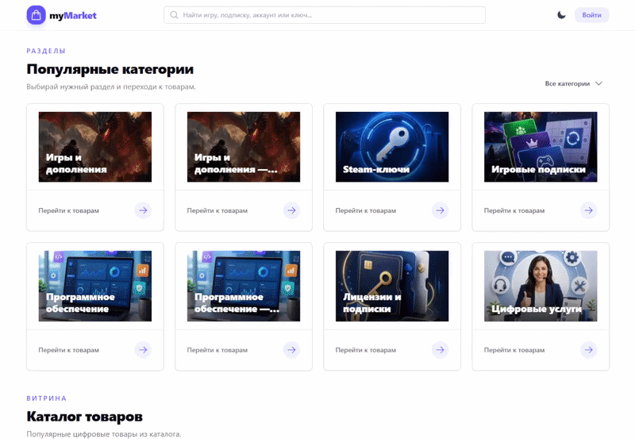
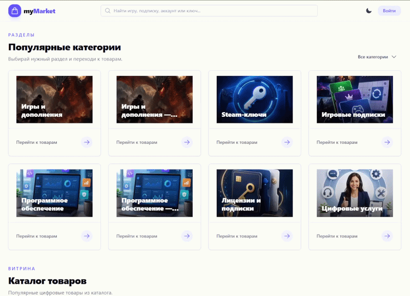
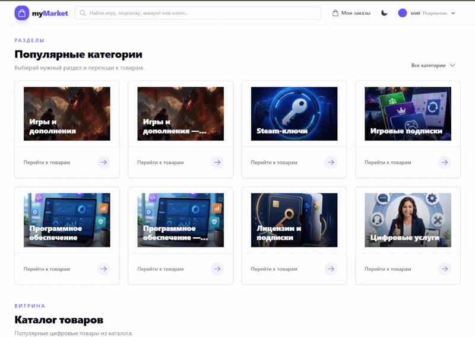

# myMarket

**Fullstack-маркетплейс цифровых товаров**

Публичный каталог, кабинет продавца, административная часть, управление цифровыми позициями, оформление заказов, резервирование, платёжный сценарий, фоновые и запланированные задачи.

`Python` · `FastAPI` · `PostgreSQL` · `SQLAlchemy` · `Redis` · `TaskIQ` · `Nuxt` · `Docker Compose` · `Nginx`

---

## Демонстрация

Ниже показаны основные клиентские сценарии публичной части: навигация по разделам,
просмотр каталога, поиск и фильтрация, а также работа с заказом.

### Навигация по категориям

Клиент просматривает доступные разделы и переходит к товарам выбранной категории.

<p align="center">
  
</p>

### Каталог товаров

Клиент просматривает витрину, карточки товаров и доступные варианты цифровых продуктов.

<p align="center">
  
</p>

### Поиск и фильтрация

Клиент использует поиск, быстрые подсказки и фильтры, чтобы найти подходящий товар.

<p align="center">
  
</p>

### Работа с заказом

Клиент выбирает товар, создаёт заказ и переходит к дальнейшей работе с ним.

<p align="center">
  
</p>

---

## О проекте

`myMarket` — fullstack-маркетплейс цифровых товаров.

Система включает публичный каталог, сценарий оформления заказа, кабинет продавца для управления товарами и цифровыми позициями, а также административную часть.

Проект охватывает полный жизненный цикл заказа:

1. Клиент выбирает товар и оформляет заказ.
2. Система проверяет доступность цифровых позиций.
3. Доступные позиции резервируются.
4. Фоновая задача формирует ссылку на оплату.
5. Webhook подтверждает оплату и переводит заказ в статус `paid`.
6. Неоплаченные заказы автоматически отменяются по истечении установленного времени.
7. Зарезервированные позиции снова становятся доступны для продажи.

Клиентская часть реализована на Nuxt. Основное приложение построено на FastAPI. Для хранения данных используется PostgreSQL, для инфраструктурных компонентов и фоновой обработки — Redis и TaskIQ. Обработка изображений вынесена в отдельный сервис. Проект запускается в контейнерном окружении через Docker Compose и Nginx.

> **Статус:** проект находится в активной разработке. Платёжный поток уже реализован на уровне приложения: фоновая задача формирует ссылку на оплату, а webhook переводит заказ в статус `paid`. Внешний платёжный провайдер пока заменён тестовой реализацией.

---

## Возможности

| Область             | Возможности                                                                                    |
| ------------------- | ---------------------------------------------------------------------------------------------- |
| **Публичная часть** | Категории, каталог, карточки товаров, изображения, фильтрация и отзывы                         |
| **Продавец**        | Управление товарами, вариантами товаров и доступными цифровыми позициями                       |
| **Администратор**   | Работа с административными сценариями и системными данными                                     |
| **Заказы**          | Создание заказа, резервирование позиций, статусы и история заказов                             |
| **Оплата**          | Формирование ссылки на оплату в фоне и обработка webhook-уведомлений                           |
| **Автоматизация**   | Плановая отмена неоплаченных заказов и освобождение резервов                                   |
| **Изображения**     | Загрузка медиафайлов и автоматическое создание миниатюр                                        |
| **WebSocket**       | Инфраструктура для сценариев, которым требуется обновление состояния без перезагрузки страницы |

---

## Роли в системе

| Роль              | Основные сценарии                                                                                                        |
| ----------------- | ------------------------------------------------------------------------------------------------------------------------ |
| **Покупатель**    | Просматривает каталог, выбирает товар, оформляет заказ и просматривает свои заказы                                       |
| **Продавец**      | Управляет собственными товарами, вариантами и отдельными цифровыми позициями                                             |
| **Администратор** | Работает с административными сценариями и системными данными                                                             |
| **Система**       | Резервирует позиции, формирует ссылки на оплату, обрабатывает webhook и освобождает позиции после истечения срока оплаты |

---

## Доменная модель

Маркетплейс состоит из нескольких связанных уровней предметной модели:

```text
Категория
    └── Товар
          └── Вариант товара
                └── Цифровые позиции

Клиент
    └── Заказ
          ├── Состав заказа
          ├── Снимок данных товара на момент покупки
          └── Статус оплаты
```

| Сущность             | Назначение                                                                         |
| -------------------- | ---------------------------------------------------------------------------------- |
| **Категория**        | Организует каталог и группирует товары                                             |
| **Товар**            | Общая карточка цифрового продукта: описание, изображения, отзывы и данные каталога |
| **Вариант товара**   | Конкретная продаваемая конфигурация товара с ценой и характеристиками              |
| **Цифровая позиция** | Отдельная единица товара, которую можно зарезервировать и продать только один раз  |
| **Заказ**            | Фиксирует покупку, состав заказа, цену, состояние оплаты и историю                 |
| **Пользователь**     | Клиент, продавец или администратор в зависимости от роли                           |
| **Отзыв**            | Обратная связь о товаре                                                            |
| **Спор**             | Сущность для сценариев разбирательств в рамках маркетплейса                        |

### Основные правила предметной области

* Цифровая позиция не может быть продана нескольким покупателям.
* При создании заказа система резервирует только доступные позиции.
* Изменение товара после оформления заказа не меняет исторические данные уже созданного заказа.
* Неоплаченный заказ имеет ограниченное время жизни.
* После отмены неоплаченного заказа резерв снимается, а позиции снова становятся доступны.
* Подтверждение оплаты переводит заказ в статус `paid`.

---

## Жизненный цикл заказа

### Создание заказа

```text
Клиент создаёт заказ
        │
        ▼
Проверка доступных цифровых позиций
        │
        ▼
Резервирование позиций
        │
        ▼
Создание заказа и сохранение снимка товарных данных
        │
        ▼
Постановка фоновой задачи на создание ссылки оплаты
        │
        ▼
Заказ ожидает оплаты
```

При создании заказа приложение:

1. Проверяет доступность выбранных цифровых позиций.
2. Резервирует позиции в рамках одного согласованного сценария.
3. Создаёт заказ.
4. Сохраняет данные товара и варианта на момент покупки.
5. Передаёт формирование ссылки на оплату в фоновую задачу.

### Подтверждение оплаты

```text
Платёжный провайдер / тестовый адаптер
        │
        ▼
Webhook
        │
        ▼
Проверка состояния заказа
        │
        ▼
Перевод заказа в статус paid
```

Webhook обрабатывает подтверждение оплаты отдельно от сценария оформления заказа. Пользовательский запрос не должен ожидать завершения внешнего платёжного взаимодействия.

### Отмена неоплаченного заказа

```text
Scheduler запускает проверку
        │
        ▼
Поиск просроченных неоплаченных заказов
        │
        ▼
Отмена заказа
        │
        ▼
Освобождение зарезервированных цифровых позиций
        │
        ▼
Позиции снова доступны для продажи
```

---

## Архитектура системы

```text
Покупатель / продавец / администратор
                │
                ▼
           Nuxt frontend
                │
                ▼
              Nginx
                │
                ▼
       FastAPI application
         │       │       │
         │       │       └── Image service
         │       │             └── создание миниатюр
         │       │
         │       └── Redis
         │             └── TaskIQ broker
         │                    ├── worker
         │                    └── scheduler
         │
         └── PostgreSQL

Платёжный провайдер / тестовый адаптер
                │
                └── webhook ──► FastAPI application
```

| Компонент               | Ответственность                                                                                |
| ----------------------- | ---------------------------------------------------------------------------------------------- |
| **Nuxt frontend**       | Публичный каталог, пользовательские сценарии, кабинет продавца и административная часть        |
| **Nginx**               | Входная точка приложения и проксирование запросов                                              |
| **FastAPI application** | HTTP API, WebSocket-endpoints, прикладная логика и координация сценариев                       |
| **PostgreSQL**          | Хранение товаров, вариантов, позиций, заказов, пользователей, отзывов и других доменных данных |
| **Redis**               | Инфраструктурные данные и работа компонентов фоновой обработки                                 |
| **TaskIQ worker**       | Выполнение фоновых задач                                                                       |
| **TaskIQ scheduler**    | Запуск задач по расписанию                                                                     |
| **Image service**       | Подготовка миниатюр изображений                                                                |
| **Payment adapter**     | Формирование ссылки на оплату и обработка платёжного сценария                                  |

---

## Архитектура исходного кода

```text
api
 │
 ├── HTTP / WebSocket endpoints
 ├── Pydantic-схемы
 └── обработка ошибок и проверка доступа
 │
 ▼
services
 │
 ├── прикладные сценарии
 ├── управление каталогом
 ├── оформление заказов
 ├── авторизация
 └── работа с пользователями
 │
 ▼
domain
 │
 ├── доменные сущности
 ├── бизнес-правила
 ├── события
 ├── исключения
 └── спецификации и фильтрация

services
 │
 ├── adapters
 │     ├── репозитории
 │     ├── PostgreSQL и Redis
 │     ├── файлы и изображения
 │     ├── HTTP-клиенты
 │     ├── платёжный адаптер
 │     ├── message broker
 │     ├── cookie
 │     └── WebSocket
 │
 ├── db
 │     ├── SQLAlchemy ORM-модели
 │     ├── реестр моделей
 │     └── мапперы между ORM и доменными объектами
 │
 ├── infra
 │     ├── авторизация
 │     ├── безопасность
 │     ├── Event Bus
 │     └── технические сервисы
 │
 └── tasks
       ├── фоновые задачи
       └── задачи по расписанию
```

### Слои и ответственность

| Слой        | Назначение                                                                              |
| ----------- | --------------------------------------------------------------------------------------- |
| `api/`      | HTTP- и WebSocket-endpoints, Pydantic-схемы, обработка ошибок и проверка доступа        |
| `services/` | Прикладные сценарии: управление каталогом, заказами, пользователями и авторизацией      |
| `domain/`   | Доменные сущности, правила, события, исключения, фильтрация и спецификации              |
| `adapters/` | Репозитории, подключение к БД и Redis, файлы, HTTP, платежи, брокер, cookie и WebSocket |
| `db/`       | SQLAlchemy ORM-модели, реестр и маппинг между ORM и доменными объектами                 |
| `infra/`    | Технические сервисы: авторизация, безопасность, Event Bus и вспомогательная логика      |
| `tasks/`    | Фоновые задачи и задачи по расписанию                                                   |
| `core/`     | Конфигурация через Pydantic Settings и логирование                                      |

### Разделение доменной модели и базы данных

Прикладные сервисы работают с доменными объектами, а не с ORM-моделями напрямую.

ORM-модели отвечают за хранение данных в PostgreSQL. Мапперы преобразуют данные между SQLAlchemy-моделями и объектами доменного слоя. Благодаря этому правила заказа, резервирования и оплаты не привязаны к деталям хранения данных.

---

## Сервис обработки изображений

`img_service.py` — отдельный сервис подготовки медиафайлов.

После загрузки изображения сервис создаёт миниатюры для разных частей интерфейса:

* каталога;
* карточки товара;
* кабинета продавца;
* административной части.

```text
Продавец / администратор загружает изображение
        │
        ▼
FastAPI application передаёт файл в image service
        │
        ▼
Image service создаёт миниатюры
        │
        ▼
Подготовленные файлы сохраняются в media storage
        │
        ▼
Связи с изображениями сохраняются в PostgreSQL
```

Выделение обработки изображений в отдельный сервис позволяет не нагружать основное приложение ресурсоёмкими операциями и не замедлять пользовательские сценарии.

---

## Технологии

| Направление        | Технологии                                   |
| ------------------ | -------------------------------------------- |
| **Backend**        | Python, FastAPI, Pydantic, Pydantic Settings |
| **Данные**         | PostgreSQL, SQLAlchemy, Alembic              |
| **Кэш и задачи**   | Redis, TaskIQ                                |
| **Frontend**       | Nuxt                                         |
| **Инфраструктура** | Docker, Docker Compose, Nginx                |
| **Тестирование**   | pytest, pytest-asyncio                       |
| **Изображения**    | отдельный сервис `img_service.py`            |

---

## Структура репозитория

```text
myMarket/
├── adapters/
│   ├── repo/
│   │   ├── category_repo.py
│   │   ├── dispute_repo.py
│   │   ├── generic_repo.py
│   │   ├── order_repo.py
│   │   ├── product_repo.py
│   │   └── review_repo.py
│   ├── cookies.py
│   ├── db_provider.py
│   ├── deps.py
│   ├── file_layers.py
│   ├── files.py
│   ├── http_client.py
│   ├── images.py
│   ├── message_broker.py
│   ├── payment.py
│   ├── redis.py
│   ├── uow.py
│   └── ws_manager.py
├── api/
│   ├── endpoints/
│   │   ├── admin.py
│   │   ├── auth.py
│   │   ├── category.py
│   │   ├── client.py
│   │   ├── order.py
│   │   ├── pages.py
│   │   ├── payment.py
│   │   ├── products.py
│   │   ├── seller.py
│   │   └── websockets.py
│   ├── schemas/
│   └── err_handlers.py
├── core/
│   ├── config.py
│   └── logger.py
├── db/
│   ├── mapper/
│   │   ├── category.py
│   │   ├── dispute.py
│   │   ├── order.py
│   │   ├── product.py
│   │   ├── registry.py
│   │   ├── review.py
│   │   └── user.py
│   └── models.py
├── domain/
│   ├── category.py
│   ├── events.py
│   ├── exceptions.py
│   ├── order.py
│   ├── product.py
│   ├── review.py
│   ├── specification.py
│   └── user.py
├── frontend/
├── infra/
│   ├── auth.py
│   ├── event_bus.py
│   ├── matcher.py
│   └── security.py
├── media/
├── migrations/
├── nginx/
├── scripts/
├── services/
│   ├── auth/
│   │   ├── auth.py
│   │   ├── tokens.py
│   │   └── users.py
│   ├── category.py
│   ├── order.py
│   └── product.py
├── tasks/
│   ├── broker.py
│   ├── deps.py
│   ├── handlers.py
│   └── tasks.py
├── tests/
├── Dockerfile
├── docker-compose.yml
├── img_service.py
├── main.py
└── shared.py
```

---

## Запуск

Проект содержит `Dockerfile`, `docker-compose.yml` и конфигурацию `nginx/` для запуска контейнерного окружения.

### Требования

* Docker Engine;
* Docker Compose;
* файл окружения `.env` с актуальными значениями конфигурации.

### Подготовка

```bash
git clone <repository-url>
cd myMarket
```

После добавления `.env.example`:

```bash
cp .env.example .env
```

Запуск контейнеров:

```bash
docker compose up --build
```

### Тесты

```bash
pytest
```


